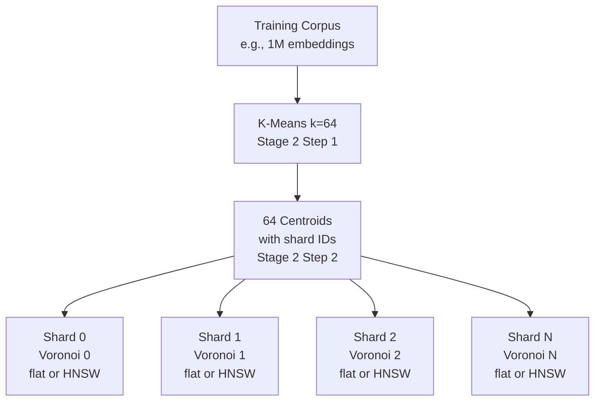
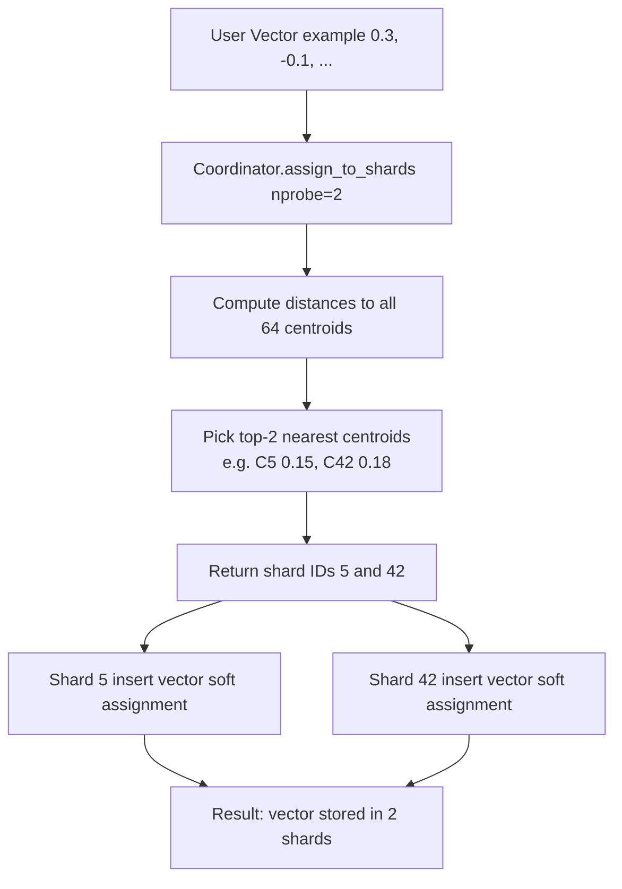
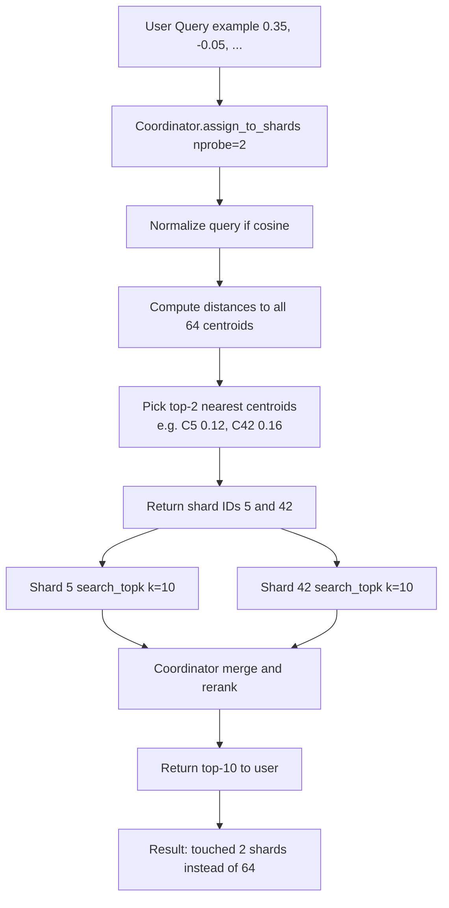
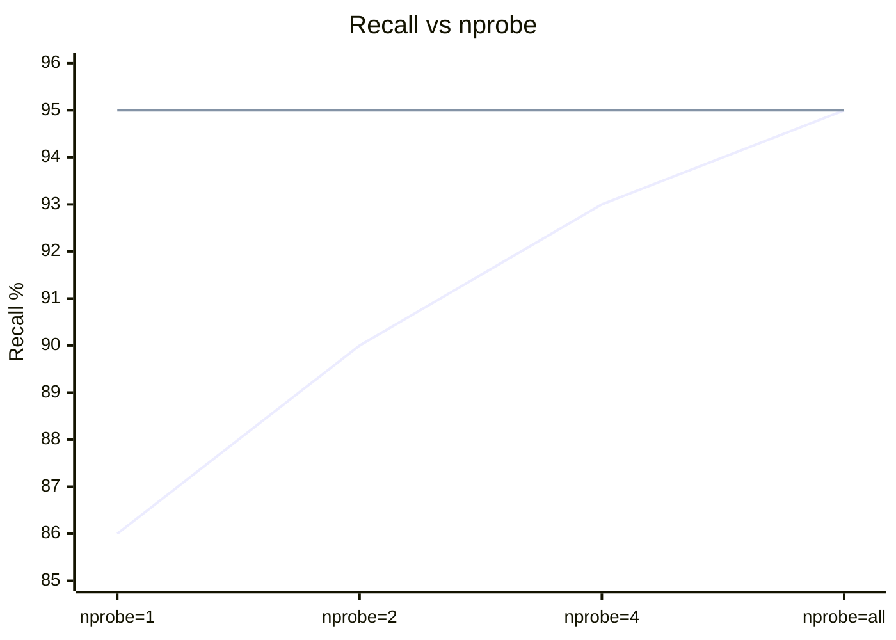
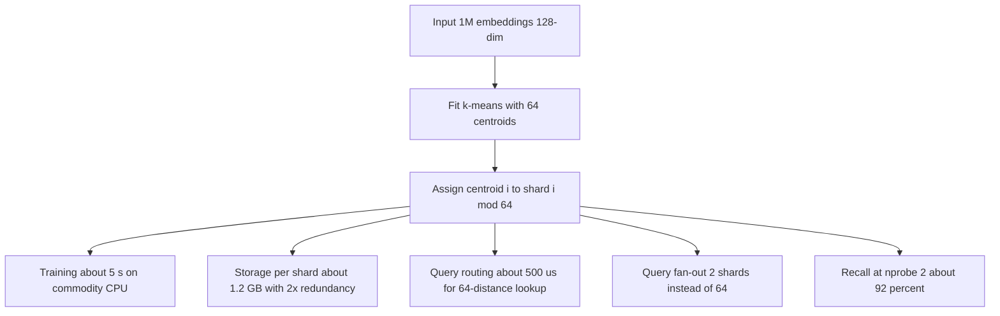

# Pattern: Vector-Space Partitioning via Voronoi Cells

## Overview

ProximaDB partitions vectors into disjoint Voronoi cells defined by k-means centroids. This enables **proximity-aware query routing**: instead of broadcasting to all shards, a query only contacts the shards whose centroids are nearest, dramatically reducing fan-out at scale.

**Core Insight:** Voronoi partitioning of vector space + shard assignment = Selective query routing

---

## Architecture

---

## Write Path (Soft Assignment)

**Soft Assignment vs. Hard Assignment:**
- **Soft (top-2):** Vector stored in 2 shards (slight redundancy, better recall for border vectors)
- **Hard (top-1):** Vector stored in 1 shard (minimal storage, reduced recall)
- **ProximaDB V1:** Uses soft (top-2) for recall; accepts 2x storage overhead

---

## Read Path (Fan-Out to Top-nprobe)

**Why This Works:**
- Vectors close in embedding space share nearby centroids
- Nearest-neighbor queries likely to find results in nearby partitions
- nprobe = 2 usually sufficient; can increase for higher recall

---

## Recall vs. Recall@nprobe Tradeoff

Result: nprobe=2 achieves ~90% of broadcast recall while touching 6% of shards.

---

## Design Decisions Captured

1. **Full-Batch K-Means:** See `0003-kmeans-design.md`
   - Deterministic, correctness-first
   - Seeded RNG for reproducibility
   - Cosine normalization before training

2. **Soft Assignment (top-2):** Trade 2x storage for better recall
   - Border vectors stored in multiple shards
   - Ensures queries near cluster boundaries find neighbors
   - Acceptable in V1 (memory-only system)

3. **Static Centroids (V1):** No online updates
   - Simplifies routing logic
   - No centroid drift management
   - Post-V1: streaming re-clustering, rebalancing

4. **Placeholder Shard IDs:** Separation of concerns
   - Clustering module agnostic to shard topology
   - CentroidTable assigns shard IDs after fitting
   - Flexible for future remapping strategies

---

## Implementation Checklist

### Stage 2 Step 1 ✅
- ✅ `fit_kmeans()` — train centroids
- ✅ `assign_to_shards()` — route queries to top-nprobe

### Stage 2 Step 2 ⏳
- ⏳ `CentroidTable` — persist, assign shard IDs, distribute
- ⏳ Coordinator gRPC — accept insert/query, route via `assign_to_shards()`

### Stage 3 ⏳
- ⏳ Staging shard — buffer vectors until k-means threshold
- ⏳ Cold-start orchestration — trigger k-means, bulk assignment

### Stage 4 ⏳
- ⏳ Per-shard HNSW — flat for small partitions, HNSW for large

### Stage 5 ⏳
- ⏳ Distributed routing — gRPC fan-out, merge results

### Stage 6 ⏳
- ⏳ Benchmarking — recall@nprobe, shards-touched analysis

---

## Metrics & Validation

### Write Path
- **Soft assignment ratio:** % of vectors assigned to 2 vs. 1 shard (should be close to 100% for border vectors)
- **Assignment correctness:** Verify top-2 shards are truly nearest centroids
- **Storage overhead:** Expected 2x (2 copies per vector)

### Read Path
- **Shard fan-out:** Count shards touched per query (should scale with nprobe, not num_shards)
- **Recall@nprobe:** Measure % neighbors found in top-nprobe shards vs. broadcast baseline
- **Latency breakdown:** Query time vs. (centroid lookup + fan-out + merge)

### Partitioning Quality
- **Centroid convergence:** Fit loss (inertia) should decrease with iterations
- **Partition balance:** Distribution of vectors per shard (variance analysis)
- **Dimension alignment:** Verify centroids reflect data distribution

---

## Example: 1M-Vector, 64-Shard Cluster

---

## Potential Issues & Mitigations

| Issue | Impact | Mitigation |
|-------|--------|-----------|
| **Centroid drift** | Recall degrades as data skews | V1: ignore; V2: online updates |
| **Partition skew** | Some shards 10x larger (bottleneck) | V1: ignore; V2: balanced k-means |
| **Border vector miss** | Top-1 hard assignment loses recall | V1: use soft (top-2); acceptable 2x storage |
| **Query dimension mismatch** | Runtime error during routing | Validate at ingestion |
| **Zero-norm vectors (cosine)** | Undefined distance | Reject or normalize to epsilon |
| **nprobe > num_centroids** | Invalid configuration | Validate at startup |

---

## Related Files

- **Implementation:** `coordinator/src/clustering.rs`
- **Tests:** `coordinator/tests/clustering.rs`
- **Storage target:** `shard/src/storage.rs` (flat store)
- **Centroid table:** `coordinator/src/centroid_table.rs` (Stage 2 Step 2)
- **Decision log:** `.github/decision-log/0003-kmeans-design.md`

---

## References

- **IVF indexes:** Jegou et al., "Product Quantization for Nearest Neighbor Search", PAMI 2011
- **Voronoi partitioning:** Inaba et al., "Applications of Weighted Voronoi Diagrams and Randomization to Computational Geometry", ISC 1994
- **Linfa k-means:** https://docs.rs/linfa-clustering/latest/linfa_clustering/
